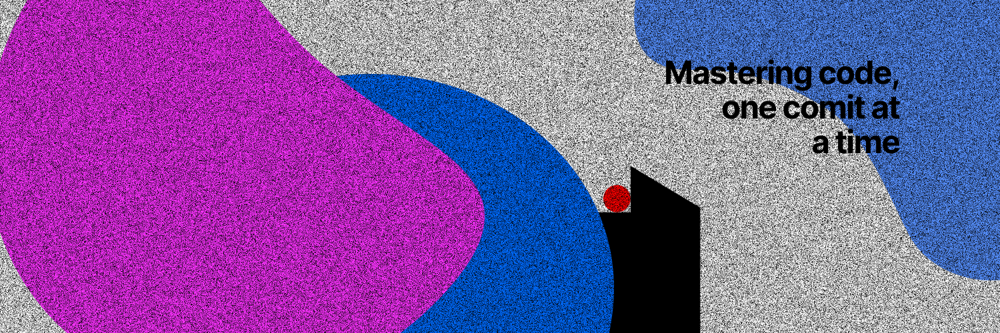

<h1 >Hi 👋, I'm Saketh Ram</h1>

## About Me

* I am a computer science graduate from IIIT Pune with a GPA of 8.14/10
* I specialize in full stack web development and deep learning and data analysis

## My Tech Stack

## 🔗 Links

